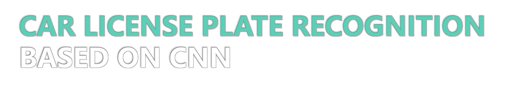
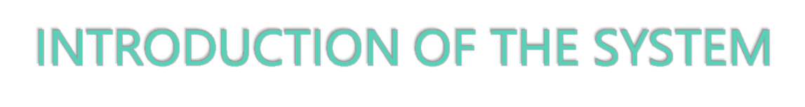
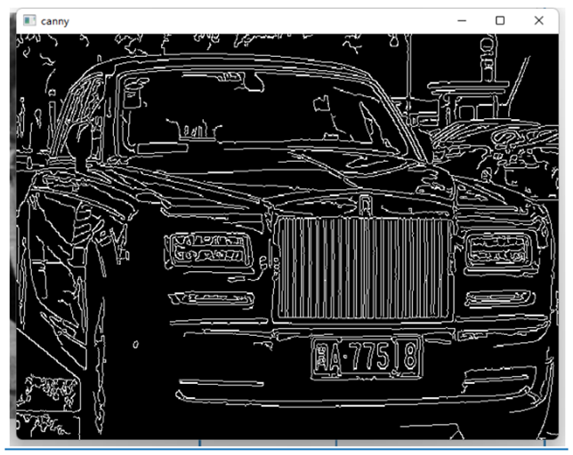
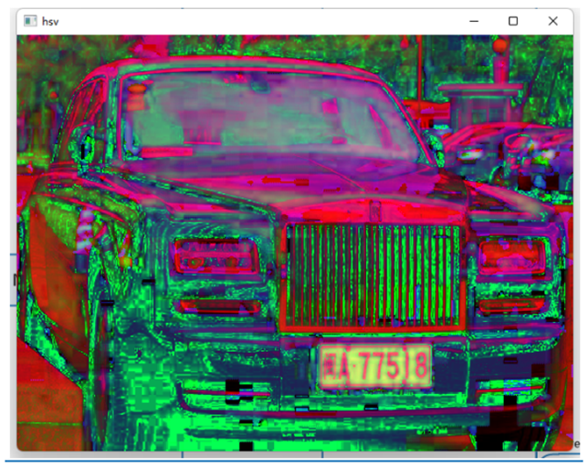
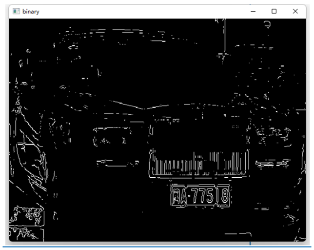
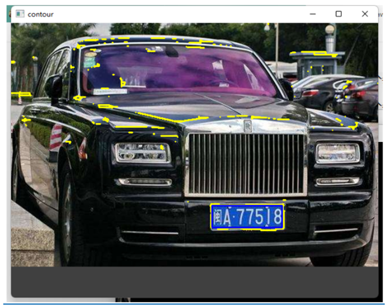
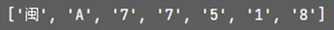
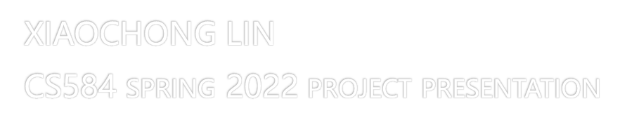

####

* This system implements a car plate recognition system, which consists of car plate location, character recognition, and convolution neural network training and recognition module.
* Experimental results show that compared with other single function methods like OpenCV template image recognition, the CNN method can reach a higher accuracy and lower loss rate.

* License plate recognition mainly includes license plate location, character segmentation, and recognition of character. In the residential district vehicle access management, the expressway toll  the car license plate recognition has been widely used.
* As a core component, Automatic License Plate Recognition (ALPR) plays an important role in modern Intelligent Transportation System (ITS). Due to the complexity in real world, many existing license plate detection and recognition approaches are not robust and efficient enough for practical applications, therefore ALPR still a challenging task both for engineers and researchers.

####

####

* This is a car plate recognition core system. It includes the core function of car plate recognition but does not include the application like user interface, package distribution and installation, and hardware utilization.
* This system succinctly takes license plate detection and recognition as two associated parts and is trained end-to-end.
* We need to train the model for car plate and character recognition separately. The training dataset can fetch from CCPD (Chinese City Parking Dataset, ECCV).
* Once the model is trained. We then can start to identify car plates. We just move the image to the specific directory, run the identification program and it will print out the identification result.

* For DEMOSTRATION
  * Move the image into the directory [./images/pictures/](./images/pictures) 
  * `run` python carlPlateIdentity.py {image name}
* For training
  * `Run` python charNeuralNet.py 0
  * `Run` python plateNeuralNet.py 0
* For testing
  * `Run` python charNeuralNet.py 1
  * `Run` python plateNeuralNet.py 1

* OpenCV
* TensorFlow
* Python 3.8
* Numpy

* In deep learning, a convolutional neural network (CNN, or ConvNet) is a class of artificial neural network (ANN), most applied to analyze visual imagery.
* It based on the shared-weight architecture of the convolution kernels or filters that slide along input features and provide translation-equivariant responses known as feature maps.
* CNNs are regularized versions of multilayer perceptions. Multilayer perceptions usually mean fully connected networks, that is, each neuron in one layer is connected to all neurons in the next layer.
* Convolutional networks were inspired by biological processes in that the connectivity pattern between neurons resembles the organization of the animal visual cortex.
* Individual cortical neurons respond to stimuli only in a restricted region of the visual field known as the receptive field. The receptive fields of different neurons partially overlap such that they cover the entire visual field.

### Principles OF CNN

* A typical CNN consists of 3 parts: Convolution layer, Pooling layer and Fully connected layer
* The convolutional layer is responsible for extracting local features in the image; the pooling layer is used to significantly reduce the parameter magnitude; the fully connected layer is similar to the traditional neural network portion and is used to output the desired result.

### Convolution - extraction features

* The operation of the convolutional layer is as shown in the figure, using a convolution kernel to scan the entire picture:
* This process we can understand is that we use a filter (convolution kernel) to filter the small areas of the image to get the eigenvalues ​​of these small areas.
* After passing through a convolutional layer, the image becomes abstracted to a feature map, also called an activation map, with shape: (number of inputs) x (feature map height) x (feature map width) x (feature map channels).

In a specific application, there are often multiple convolution kernels. It can be considered that each convolution kernel represents an image mode. If an image block is convolved with the convolution kernel, the image block is considered to be Very close to this convolution kernel. If we design 6 convolution kernels, we can understand that we think there are 6 underlying texture patterns on this image, that is, we can draw an image using the basic mode in 6. The following are examples of 25 different convolution kernels:

### Pooling - dimensionality reduction

* The pooling layer is simply a down sampling, which can greatly reduce the dimensions of the data. The process is as follows
* The reason for this is that even after the convolution is done, the image is still large (because the convolution kernel is small), so in order to reduce the data dimension, the downsampling is performed.

### Fully connected layer - Classification 

* Fully connected layers connect every neuron in one layer to every neuron in another layer. It is the same as a traditional multilayer perceptron neural network (MLP). The flattened matrix goes through a fully connected layer to classify the images.
* A typical CNN is not just the 3-layer structure mentioned above, but a multi-layer structure, such as the structure of LeNet-5

####

#

#

### Repository address 

[https://github.com/XIAOCHONG-LIN/CarPlateRecognizationCNN](https://github.com/XIAOCHONG-LIN/CarPlateRecognizationCNN)

* `carPlateIdentity.py` – the main module for identify the car plate
* `charNeuralNet.py` – the training module for identify the character of car plate
* `plateNeuralNet.py` – the training module for identify the car plate image
* [carIdentityData](./carIdentityData) – the training dataset category
* [Images](./images) – the identification module image category

### Data set

* We use CCPD (Chinese City Parking Dataset, ECCV) as the training and testing dataset.
* Dataset includes five directories
  * Character training dataset
  * Character testing dataset
  * Car plate training dataset
  * Car plate testing dataset
* The model is stored in ‘model’ sub directory.

### Training – character 

* Initial data
* Split the train data and test data
* Construct CNN layers
* Soft max normalization
* Set the rule of accuracy calculation
* Set the rule of the cost calculation
* Set the train step
* Start training

### _in around 500 steps, the accuracy converges to higher than 99%_

### Training – car plate 

* Initial data
* Split the train data and test data
* Construct CNN layers
* Soft max normalization
* Set the rule of accuracy calculation
* Set the rule of the cost calculation
* Set the train step
* Start training

### _in around 250 steps, the accuracy converges to higher than 99%_

### Testing – character

* Initial data
* Construct cnn layers
* Softmax normalization
* Set the predicted axis
* Start testing

#### 
* _total: 549, incorrect: 26, accuracy: 0.9526411657559198_

### Testing – car plate

* Initial data
* Construct cnn layers
* Softmax normalization
* Set the predicted axis
* Start testing
####
* _total: 200_  
  * _incorrect: 62 0.6388506_
  * _incorrect: 77 0.72059715_
  * _incorrect: 147 0.83242637_
* _contains car plate:98, no car plate:99, accuracy: 0.985_

### processing image

* Convert to grayscale

* Gaussian blur

`kernel_size = 5`

`gauss_gray = gaussian_blur(gray_img, kernel_size)`

* Canny edge finding

`low_threshold = 50`

`high_threshold = 150`

`canny_edges = canny(gauss_gray, low_threshold, high_threshold)`

* Convert to hsv image 

`hsv_img = cv2.cvtColor(orig_img, cv2.COLOR_BGR2HSV)`

`h, s, v = hsv_img[:, :, 0], hsv_img[:, :, 1], hsv_img[:, :, 2]`

* Find blue area

`blue_img = (((h > 26) & (h < 34)) | ((h > 100) & (h < 124))) & (s > 70) & (v > 70)`

`blue_img = blue_img.astype('float32') `

* Find the blue edge

`mix_img = np.multiply(canny_edges, blue_img)`

* Binarization

`ret1, binary_img = cv2.threshold(mix_img, 0, 255, cv2.THRESH_BINARY | cv2.THRESH_OTSU) `

* Find contours  

`contours, hierarchy = cv2.findContours(pred_image, cv2.RETR_EXTERNAL, cv2.CHAIN_APPROX_SIMPLE) `

* Locate car plate
  * Flood fill the area
  
    
  
  * Get the mask area

    

###   CNN building

* build three convolution and pooling layers

`cw1 = tf.Variable(tf.random_normal(shape=[3, 3, 1, 32], stddev=0.01), dtype=tf.float32)`

`cb1 = tf.Variable(tf.random_normal(shape=[32]), dtype=tf.float32)`

`conv1 = tf.nn.relu(tf.nn.bias_add(tf.nn.conv2d(x_input, filter=cw1, strides=[1, 1, 1, 1], padding='SAME'), cb1))`

`conv1 = tf.nn.max_pool(conv1, ksize=[1, 2, 2, 1], strides=[1, 2, 2, 1], padding='SAME')`

`conv1 = tf.nn.dropout(conv1, self.keep_place)`

* build three fully connection layers

`fw1 = tf.Variable(tf.random_normal(shape=[3 * 3 * 128, 1024], stddev=0.01), dtype=tf.float32)`

`fb1 = tf.Variable(tf.random_normal(shape=[1024]), dtype=tf.float32)`

`fully1 = tf.nn.relu(tf.add(tf.matmul(conv_out, fw1), fb1))`

`fully1 = tf.nn.dropout(fully1, self.keep_place)`

### Recognition

* result index: 0 result probability: 0.9999999

###

* This system is still trivial comparing the current car license plate recognition system. It just runs a basic functional module for recognize the car plate. But it covers the main idea of the recognition system.
* With more complicate environment such as the image is distorted by light, environment color, angle of car license plate, etc. this system will reduce the accuracy.
* There is a technology named lightweight CCN DSNET exist in paper https://link.springer.com/chapter/10.1007/978-3-030-60639-8_25 which could be the next study direction to improve the accuracy in complicate environment.

https://blog.csdn.net/jmh1996/article/details/88951797

https://en.wikipedia.org/wiki/Convolutional_neural_network

https://easyai.tech/en/ai-definition/cnn/ 

http://ufldl.stanford.edu/tutorial/supervised/FeatureExtractionUsingConvolution/

https://www.analyticsvidhya.com/blog/2020/02/mathematics-behind-convolutional-neural-network/

SLPNet: Towards End-to-End Car License Plate Detection and Recognition Using Lightweight CNN https://link.springer.com/chapter/10.1007/978-3-030-60639-8_25

####

